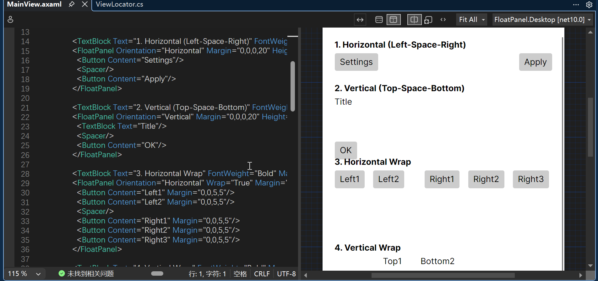

# FloatPanel.Avalonia

A flexible layout panel for Avalonia UI, inspired by MudBlazor's MudStack and MudSpacer components.

## Features

- **FloatPanel** - A versatile layout container with support for:
  - Horizontal and vertical orientations
  - Configurable spacing between child elements
  - Justify content alignment (Start, Center, End, SpaceBetween, SpaceAround, SpaceEvenly)
  - Cross-axis alignment (Start, Center, End, Stretch)
  - Automatic wrapping when content overflows

- **Spacer** - A lightweight component that occupies remaining space in a FloatPanel

## Supported Platforms

| Platform | Status |
|----------|--------|
| Windows | Supported |
| macOS | Supported |
| Linux | Supported |
| WebAssembly (WASM) | Supported |
| iOS | Supported |
| Android | Supported |

## Demo



[Watch Video Demo](docs/images/floatpanel-demo.mp4)

## Installation

### NuGet Package

```bash
dotnet add package FloatPanel
```

## Quick Start

### Horizontal Layout (Left-Space-Right)

```xml
<FloatPanel Orientation="Horizontal">
    <Button Content="Settings"/>
    <Spacer/>
    <Button Content="Apply"/>
</FloatPanel>
```

### Vertical Layout (Top-Space-Bottom)

```xml
<FloatPanel Orientation="Vertical">
    <TextBlock Text="Title"/>
    <Spacer/>
    <Button Content="OK"/>
</FloatPanel>
```

## API Reference

### FloatPanel Properties

| Property | Type | Default | Description |
|----------|------|---------|-------------|
| `Orientation` | `Orientation` | `Horizontal` | Layout direction |
| `Spacing` | `double` | `8` | Space between children in pixels |
| `Justify` | `JustifyContent` | `Start` | Main axis alignment |
| `Align` | `AlignItems` | `Stretch` | Cross axis alignment |
| `Wrap` | `bool` | `false` | Enable wrapping |

### JustifyContent Enum

- `Start` - Align to start
- `Center` - Align to center
- `End` - Align to end
- `SpaceBetween` - Equal space between items
- `SpaceAround` - Equal space around items
- `SpaceEvenly` - Uniform spacing

### AlignItems Enum

- `Start` - Align to start of cross axis
- `Center` - Align to center of cross axis
- `End` - Align to end of cross axis
- `Stretch` - Stretch to fill cross axis

## Project Structure

```
FloatPanel.Avalonia/
├── FloatPanelLib/           # Control library
│   ├── Controls/
│   │   ├── FloatPanel.cs    # Main layout panel
│   │   └── Spacer.cs        # Space-filling component
│   └── AssemblyInfo.cs      # XML namespace definition
├── FloatPanel.UI/          # Shared UI project
│   ├── Views/
│   │   └── MainView.axaml  # Example usage
│   ├── ViewModels/          # View models
│   ├── App.axaml           # Application definition
│   └── ViewLocator.cs       # View locator
├── FloatPanel.Desktop/     # Desktop application
├── FloatPanel.Browser/     # WebAssembly application
├── docs/                   # Documentation (docfx)
└── docfx.json              # docfx configuration
```

## Documentation

Full documentation is available in the docs/ folder or via docfx.

## License

MIT