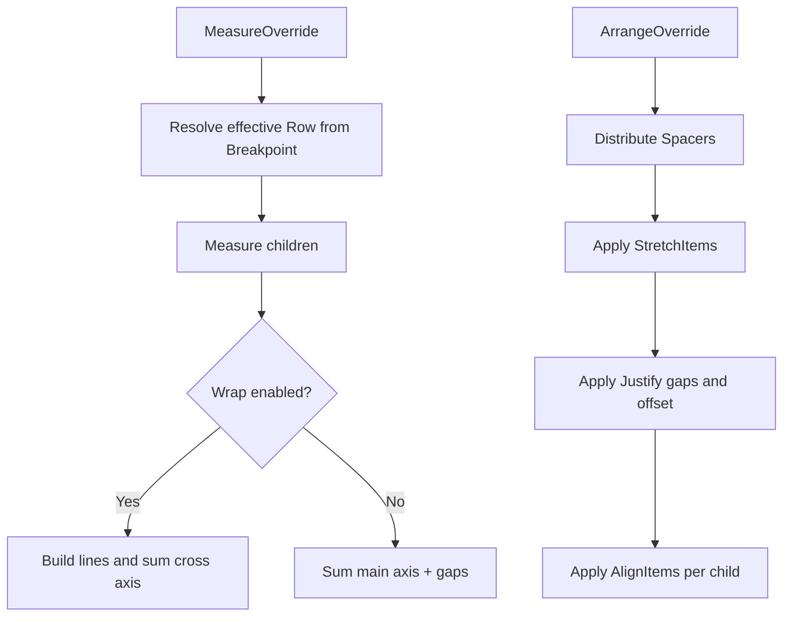

# Architecture

FloatPanel is a custom `Panel` that performs flex-like measure/arrange in managed code — Avalonia has no built-in CSS flexbox.

## Layout pipeline

## Spacing

`Spacing` is an integer multiplier of **4 px**, matching MudStack. `Spacing="3"` → 12 px gap between adjacent children. Spacers do not add gaps themselves.

## Spacer

`Spacer` measures to `(0,0)` and receives all remaining main-axis space after siblings are measured. Multiple spacers split the remainder equally — same role as `MudSpacer`.

## Breakpoints

When `Breakpoint` is not `None`, FloatPanel reads its `Bounds.Width` and toggles between `Row` and `!Row` using MudBlazor-compatible width thresholds:

| Name | Width (px) |
|------|------------|
| Sm | 600 |
| Md | 960 |
| Lg | 1280 |
| Xl | 1920 |
| Xxl | 2560 |

Layout is invalidated when the panel width crosses a threshold.

## Wrap

With `Wrap="Wrap"`, children are grouped into lines along the main axis. Each line is laid out independently with the same Justify/AlignItems rules. `WrapReverse` reverses line order on the cross axis.

## Source layout

| File | Role |
|------|------|
| `FloatPanel.cs` | Styled properties, measure/arrange entry |
| `FloatPanelLayout.cs` | Line building, justify, stretch, spacer math |
| `BreakpointHelper.cs` | Viewport → effective Row |
| `Spacer.cs` | Zero-size flex-grow child |
